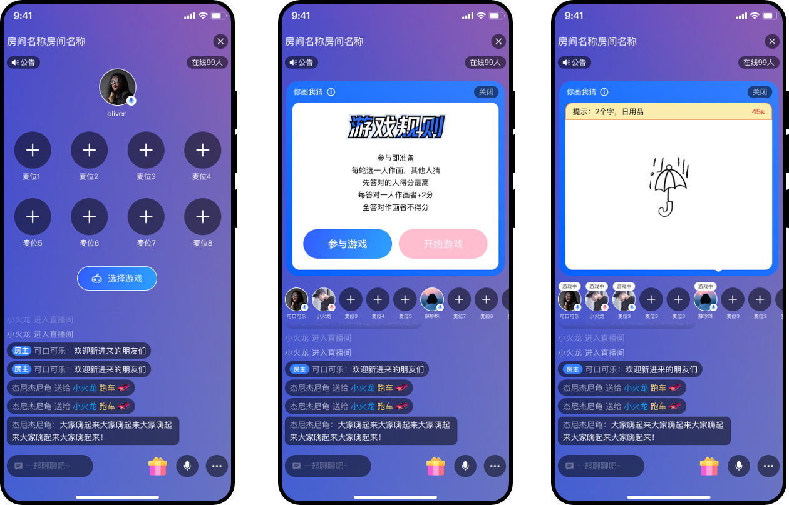

# 简介

游戏房是近年来泛娱乐社交领域出现的一种新的玩法，它为用户提供了更加多元化的社交和游戏体验。在语聊房中增加小游戏，可以提高用户留存率和停留时长。游戏房为泛娱乐社交领域注入了新的活力和动力，为用户带来了更好的体验。

# 场景概述

通过将游戏和语聊房进行无缝连接，让用户在语聊房中进行多种玩法，例如五子棋、你画我猜等，从而增强了用户在社交场景中的参与度和互动性。同时，游戏房也为用户提供了一种全新的社交方式，让用户可以通过游戏来结交新的朋友，成为了泛娱乐社交领域中的一大亮点。

为了让您能够更快速地上线游戏房，网易云信结合 RTC 技术和供应商资源，提供一站式的小游戏接入方案。该方案提供了现成的 Demo App 和开源的 Demo 源码，直接覆盖第三方小游戏接入逻辑，从而简化应用程序开发者的工作，降低开发成本和开发时间，并提高应用程序的开发效率。

## 角色说明

| 角色  | 描述                                                        | 游戏权限 |
| --------- | ------------------------------------------------ | --- |
| 房主/主播 | 创建游戏房的用户，对应游戏中的队长玩家                     | 创建游戏、参与游戏、开始游戏、切换游戏、结束游戏 |
| 连麦观众 | 麦位上的用户                 | 参与游戏 |
| 普通观众 | 不在麦位上且不在游戏中的用户 | 不能参与游戏，上麦后才能参与游戏 |
| 游戏玩家 | 在麦位上且在游戏中的用户             | 离开游戏 |

# 效果演示

>您可以扫描下方二维码，下载并体验demo。

| iOS                       | Android                       |
| ------------------------- | ----------------------------- |
|  |  |

游戏房 Demo 的界面效果图如下所示：

# 联系我们

- 如果想要了解该场景的更多信息，请参见[游戏房场景方案文档](https://doc.yunxin.163.com/group-voice-room/docs/jU5ODcyMTg?platform=android)
- 如果您遇到的问题，可以先查阅[知识库](https://faq.yunxin.163.com/kb/main/#/)
- 如果需要售后技术支持，请[提交工单](https://app.yunxin.163.com/index#/issue/submit)  

# 更多场景方案

网易云信针对1V1娱乐社交、语聊房、PK连麦、在线教育等业务场景，推出了一体式、可扩展、功能业务融合的全链路解决方案，帮助客户快速接入、业务及时上线，提高营收增长。

- [1对1 娱乐社交](https://github.com/netease-kit/1V1)
- [语聊房](https://github.com/netease-kit/NEChatroom)
- [PK连麦](https://github.com/netease-kit/OnlinePK)
- [在线教育](https://github.com/netease-kit/WisdomEducation)
- [多人视频通话](https://github.com/netease-kit/NEGroupCall)
- [在线K歌](https://github.com/netease-kit/NEKaraoke)
- [一起听](https://github.com/netease-kit/NEListenTogether)
- [云信娱乐社交服务端 Nemo](https://github.com/netease-kit/nemo)
